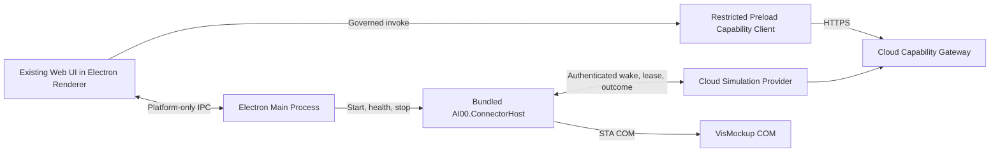

# Governed Electron App Migration Design

## Status and decision

This specification defines the Windows desktop successor to the current web plus AI Connector deployment. The approved direction is an Electron application that reuses the current production web assets without a UI rewrite, connects to the existing cloud backend, and ships the VisMockup Connector as an application-owned component.

The first supported platform is Windows x64. The product has one installer, one application entry, one update channel, and one AI00 tray presence. The Connector is not installed as a Windows Service, does not expose its own tray icon, and cannot run independently as a user-facing product. Electron and Chromium use multiple operating-system processes by design; this specification does not require a single process in Task Manager. It requires one product lifecycle controlled by the Electron main process.

The implementation baseline is the `test` branch at frontend commit `08222e876d0ab8a8c477e6d66b6bda66ac70af88` and backend commit `561efece898d8cf5a78d6e3855c5669c8bbf619b`.

## Goals

- Preserve the current UI structure, styling, iframe behavior, navigation, custom title bar, shortcuts, themes, and workflows by packaging the existing Vite production output in Electron.
- Keep the cloud backend and Capability Gateway as the sole authority for business authorization, confirmation, state transitions, execution plans, audit, and result projection.
- Replace the independently installed Connector Service, Connector tray, SessionHost, and legacy Python VisMockup Bridge with one hidden ConnectorHost distributed and controlled by the Electron application.
- Preserve the existing C# VisMockup adapter, COM/STA execution, device credential, signed-plan, lease, idempotency, timeout, recovery, and outcome code where its contracts already meet this specification.
- Produce one signed Windows x64 installer with coordinated App and ConnectorHost versions, upgrade, rollback, repair, and uninstall behavior.
- Require complete Capability governance and release evidence before an App release candidate can be promoted.

## Non-goals

- Rewriting the current web UI in WPF, WinUI, React, or another UI framework.
- Packaging the cloud backend or database inside the desktop application.
- Supporting macOS, Linux, ARM64, offline business operation, or a local business data store in the first release.
- Allowing Renderer code, Electron IPC, a named pipe, or ConnectorHost to become an alternative business command channel.
- Restoring browser-to-loopback HTTP, the Python VisMockup Bridge, or direct browser-to-COM access.
- Adding a general-purpose local plugin execution system as part of this migration.

## System architecture

The system retains the current cloud control plane and changes the desktop delivery boundary.

The Renderer expresses business intent only through the Capability Gateway. The Electron main process supplies platform functions such as window management, file selection, notifications, update control, and ConnectorHost lifecycle. ConnectorHost obtains executable work only from the cloud control plane. A local message from Renderer or Electron main can never authorize or describe a VisMockup business operation.

## Component responsibilities

### Existing Web UI

The App packages the existing `dist-production` UI. App migration work must not restructure page layout or replace current components during the initial migration. Existing relative and absolute resource paths are served from a secure application origin. Critical pages receive screenshot and interaction regression coverage so Chromium or packaging changes are detected.

The Renderer cannot access Node.js, Electron primitives, device credentials, local plan signatures, unrestricted filesystem APIs, or raw IPC. It receives a small frozen bridge from preload.

### Restricted preload bridge

The existing broad `electronAPI` surface is inventoried and divided into two classes:

- Platform operations: bounded window, dialog, notification, deep-link, update, and user-selected file operations. These remain IPC operations with closed request and response schemas.
- Business operations: any call that reads or changes AI00 business state. These move to the cloud Capability client and are removed from Electron IPC.

The Capability client adds the registered desktop web consumer identity and current Catalog Release to each invocation. It preserves idempotency and confirmation tokens across retriable calls. Authentication material remains outside page JavaScript. Page code receives normalized success or structured failure envelopes and cannot obtain the raw login or device credential.

### Electron main process

The main process owns application lifecycle, windows, the single AI00 tray, deep links, global shortcuts, platform dialogs, updater orchestration, logging, and ConnectorHost supervision. It validates every IPC request against an allowlist and a closed schema. It restricts file access to paths selected by the user or application-owned directories and validates every external URL before opening it.

At startup it launches the packaged ConnectorHost with an unguessable per-launch named-pipe name and the Electron parent process identifier. It does not send business payloads or user access tokens over that pipe. It receives only version, readiness, health, pairing-state, and bounded diagnostic events. On normal exit it requests a graceful ConnectorHost shutdown and then enforces termination. ConnectorHost independently exits when the parent process disappears.

### AI00.ConnectorHost

`AI00.ConnectorHost.exe` is a Windows x64 .NET application shipped inside the Electron installer. It runs hidden in the interactive user session so it can use VisMockup COM. It reuses the existing Connector contracts and adapters, but replaces the Service, Tray, and SessionHost topology with one application-owned host.

ConnectorHost owns:

- DPAPI-protected device credentials bound to the current Windows user.
- Device pairing and activation state supplied by the cloud control plane.
- Authenticated outbound WebSocket wake-up and bounded HTTP polling fallback.
- Signed execution-plan leasing, validation, replay protection, and expiry checks.
- Adapter compatibility and contract-hash validation.
- STA scheduling, VisMockup process detection, COM execution, step timeout, cancellation, and structured outcomes.
- Durable recovery metadata needed to reconcile an interrupted lease after App restart.

ConnectorHost does not listen on TCP, expose a loopback API, display a tray icon, accept Renderer commands, or make business authorization decisions.

### Cloud control plane

The existing cloud backend remains the deployment and business authority. It continues to provide Capability discovery and invocation, authentication, device pairing, plan creation, explicit confirmation, signed plan queueing, leases, wake-up, outcome ingestion, audit, and business-state projection.

Cloud additions are limited to App compatibility policy and evidence required by this design. The policy binds minimum supported App version, Connector protocol version, adapter version, and Catalog Release. An incompatible App may use non-device features when safe, but local execution fails closed with a structured upgrade requirement.

## Capability governance

The desktop migration is governed as a change of consumers and providers, not as permission to reuse the old App's direct IPC or REST behavior.

### Consumer and provider identities

- The packaged Renderer is registered as a desktop web consumer with exact frontend source and build evidence.
- ConnectorHost is registered as a local-runtime consumer and execution provider with exact executable, protocol, adapter, and source evidence.
- Electron main is a platform host. It is not registered as a business provider unless a future requirement introduces a real business Capability owned by a domain.
- Each App release binds its frontend commit, backend Catalog Release, ConnectorHost build, adapter manifest, and installer digest.

### Invocation rules

- Every business read and write starts at `/api/capabilities/{capability_id}/versions/{major_version}/invoke` or its governed streaming equivalent.
- New direct REST routes, Electron IPC business methods, loopback methods, and Renderer-to-Connector commands are release blockers.
- A local side effect requires a cloud-issued immutable execution plan bound to capability ID, major version, capability-version GID, Catalog Release, tenant, actor, device, adapter contract, normalized input hash, confirmation receipt when required, idempotency identity, issue time, and expiry time.
- ConnectorHost verifies the plan signature and every binding before execution. Unknown fields, versions, operations, steps, or algorithms fail closed.
- Results are authenticated and bound to the leased plan and step. Only the cloud Provider can apply the resulting business transition.
- WebSocket messages are wake-up signals only. They cannot contain an executable plan or command.

### Release evidence

An App release candidate cannot be promoted until the affected Capability set has current machine evidence, human approval, and runtime verification. The release must satisfy `machine_passed=true`, `human_approved=true`, and `runtime_verified=true`. Evidence binds immutable Git revisions and generated artifacts rather than a dirty working tree.

The current historical blockers must be resolved before the first App release candidate:

- The business-definition hashes for `ontology.concept.get@1`, `ontology.concept.resolve@1`, and `ontology.object.list@1` differ from the legacy governance baseline after the governed schema restoration commit.
- The checked-in Agent runtime closure acceptance evidence does not contain the required `business_governance` section.

Resolving these blockers requires corrected versioning or approved business-definition evidence and regenerated closure evidence. The App migration must not weaken the Release Gate or silently rewrite the legacy baseline.

## Runtime flows

### Startup and compatibility

1. Electron acquires the single-product lock and creates the login or main window.
2. The main process launches ConnectorHost and establishes the per-launch named pipe.
3. The App loads its packaged UI from a secure local application origin.
4. After authentication, the Capability client obtains the cloud Catalog Release and compatibility policy.
5. The client rejects capabilities absent from or incompatible with the pinned release.
6. ConnectorHost authenticates with its device credential, reports its protocol and adapter versions, and starts the wake-up channel.
7. The UI displays Connector readiness from cloud-owned pairing and health state. Local diagnostic state may enrich the display but cannot override cloud authorization.

### Governed VisMockup execution

1. Renderer invokes the relevant Simulation Capability through the cloud Gateway.
2. Gateway authenticates the user and desktop consumer, authorizes tenant and resource scope, validates the closed input schema, and records audit identity.
3. The Simulation Provider prepares an immutable plan and, where required, returns the exact downstream confirmation challenge.
4. Renderer resubmits the approved challenge with the same operation and idempotency identity.
5. Provider queues the signed device-bound plan and emits a wake-up signal.
6. ConnectorHost leases the plan over authenticated HTTPS and verifies every signed binding.
7. The adapter executes the bounded operation through the STA dispatcher.
8. ConnectorHost submits the authenticated outcome. The Provider applies or rejects the state transition and records audit evidence.
9. Renderer obtains the authoritative result from the cloud Capability state, never from an unaudited local success message.

### Pairing

Pairing begins from an authenticated App Capability. The cloud returns a short-lived bootstrap identity that is bound to the intended tenant, user, and device activation. ConnectorHost completes activation and stores only the resulting device credential under DPAPI. Pairing secrets are not placed in Renderer storage, command-line arguments, log files, URLs retained in history, or the local named pipe.

### Update

The signed release manifest describes the Electron version, ConnectorHost version, protocol versions, adapter manifest hash, installer digest, channel, and rollback compatibility. Electron owns update discovery and user interaction. Installation is atomic at the product level: App and ConnectorHost cannot be updated independently. ConnectorHost is stopped before replacement. Failed installation retains the previous complete version.

## Cloud deployment impact

The backend, Capability Gateway, domain Providers, database, and Connector control plane remain cloud deployed. No local backend or local database is introduced. The existing authenticated WebSocket endpoint remains a wake-up transport, with bounded HTTP polling as loss recovery.

The cloud deployment gains an App compatibility policy and release metadata, but does not require a new independently scaled business service. Schema migrations are limited to fields or records that are demonstrably missing from the current device, plan, lease, outcome, audit, and compatibility models.

During migration, the current web deployment remains available for rollback and users not yet moved to the App. After App adoption and runtime evidence meet the agreed threshold, ordinary user navigation to the web product can be retired separately. Administrative diagnostics may remain web hosted if they are explicitly governed and operationally required.

App binaries are published through a release-artifact channel rather than committed to Git history. Gitea retains full source history; GitHub receives sanitized source snapshots when repository history contains oversized installers. GitLab is outside the publishing scope.

## Failure and recovery behavior

- ConnectorHost unavailable: App remains usable for cloud-only capabilities; device-dependent capabilities return an explicit unavailable state and a bounded repair action.
- Wake-up connection unavailable: ConnectorHost reconnects with bounded backoff and uses the existing two-second poll as recovery. The plan lease remains authoritative.
- App or ConnectorHost crash: ConnectorHost exits when its parent disappears. A leased plan is reconciled by idempotent outcome lookup or lease expiry after restart.
- VisMockup absent or incompatible: the adapter returns a structured non-retriable compatibility error without launching an alternative executable or performing a partial command.
- COM timeout or cancellation: the current step records a bounded failure or cancellation outcome. Later steps do not execute unless the signed plan explicitly permits that transition.
- Signature, hash, device, tenant, actor, Catalog, version, expiry, or replay failure: execution is rejected before COM invocation and a security audit event is submitted when authentication permits.
- Cloud unavailable: no new local business operation begins. Pending UI intent remains uncommitted and is safe to retry with its original idempotency identity.
- Update failure: the prior complete signed version remains runnable. An App/ConnectorHost version mismatch prevents local execution.
- Local diagnostic pipe failure: business execution can continue through the cloud control plane; the UI shows diagnostic state as unavailable rather than inferring success.

## Security boundaries

- BrowserWindow instances use context isolation, disabled Node integration, sandboxing where supported, a restrictive Content Security Policy, navigation allowlists, permission denial by default, and validated external-link handling.
- The local application origin resolves only packaged allowlisted files and rejects traversal, encoded traversal, unexpected hosts, and mutable remote content.
- Preload exposes named functions rather than `ipcRenderer`, `shell`, arbitrary channels, arbitrary filesystem paths, or arbitrary URLs.
- The main process applies schema validation and sender-origin validation to every IPC handler.
- Device credentials are DPAPI protected, never returned to Renderer, and redacted from logs and crash reports.
- Named-pipe access is restricted to the current user and launch instance. The pipe protocol has a version and closed message schemas.
- Connector plans and outcomes use the existing canonical serialization and signing rules. Compatibility changes require a new protocol or Capability version instead of permissive parsing.

## Packaging and lifecycle

The supported artifact is one Windows x64 installer produced by Electron Builder. It contains the production web assets, Electron main and preload files, official desktop plugin assets, ConnectorHost, the required .NET runtime or self-contained output, and signed release metadata. It excludes backend source, test fixtures, local secrets, generated test directories, update installers from prior versions, and developer tools.

Installation creates the AI00 App registration, deep-link protocol, shortcuts, and updater metadata. It does not create a Windows Service or a separate Connector startup entry. Uninstall removes application-owned binaries and registrations. User-owned documents remain unless the user explicitly chooses removal; device credentials and recovery state follow an explicit security deletion policy implemented by the uninstaller.

## Migration stages

### Stage 0: close baseline governance blockers

Resolve the three Ontology business-definition baseline mismatches and regenerate the Agent closure evidence. Establish a passing Release Gate on immutable frontend and backend commits before App-specific changes are accepted.

### Stage 1: govern the existing Electron shell

Keep the UI unchanged. Inventory main/preload IPC and all Electron-only call sites, classify platform and business operations, remove direct business paths, restrict the application protocol and BrowserWindow settings, register desktop consumer identity, and add packaged UI regression coverage.

### Stage 2: create the application-owned ConnectorHost

Build one .NET host from the existing Connector contracts, service worker, SessionHost, and VisMockup adapter code. Run it in the interactive user session, add parent-lifecycle supervision and diagnostic named-pipe messages, and retain cloud-only business command flow. Prove parity with existing Connector tests before removing old deployment projects.

### Stage 3: integrate product lifecycle

Package ConnectorHost with Electron, implement coordinated startup, repair, update, rollback, and uninstall, and remove the Python Bridge, independent Service installer, separate Tray, and SessionHost launch paths from the App distribution.

### Stage 4: pilot and cutover

Release to a bounded Windows x64 pilot group. Collect runtime evidence for pairing, wake-up latency, plan execution, VisMockup lifecycle, crash recovery, upgrade, rollback, and uninstall. Promote only after governance approval and runtime verification. Retain web and old Connector rollback paths during the pilot, then retire independent Connector distribution after the cutover criteria pass.

## Verification strategy

### Static and contract checks

- Capability Catalog generation and Release Gate validation.
- Desktop consumer and local-runtime provider coverage with immutable source hashes.
- Direct REST, loopback, IPC business-route, and Renderer-to-Connector scans.
- Closed JSON schemas for preload IPC, named-pipe diagnostics, execution plans, outcomes, and update manifests.
- Installer-content allowlist and oversized or secret artifact scans.

### Automated tests

- Existing frontend test suite against both source and packaged production assets.
- Screenshot and interaction regression tests for login, workspace, Craft lineage, standard operations, Simulation/VisMockup, settings, pop-out windows, and approval flows.
- Electron main/preload tests for sender validation, navigation, protocol traversal, file bounds, token isolation, and process supervision.
- ConnectorHost unit tests for parent exit, one-instance behavior, named-pipe ACL, startup failure, shutdown, recovery, and version mismatch.
- Existing Connector contract, DPAPI, plan, lease, signature, replay, STA, timeout, cancellation, and VisMockup adapter tests.
- Cloud tests for App compatibility policy, device binding, confirmation, wake-up transport, lease recovery, outcome application, and audit.
- Installer tests on clean Windows x64 and upgrade tests from the last supported App version.

### Runtime evidence

Runtime verification records exact App, ConnectorHost, backend, Catalog, adapter, and installer identities. The pilot exercises normal execution and failure injection for lost WebSocket, cloud outage, App crash, ConnectorHost crash, VisMockup absence, COM timeout, duplicate delivery, expired plans, incompatible versions, failed update, rollback, and uninstall. Evidence includes plan creation-to-step-start latency and proves that no local command bypass occurred.

## Acceptance criteria

- Current UI pages and key interactions remain within the approved visual and behavioral regression baseline.
- Users install, start, update, repair, and uninstall one AI00 Windows x64 product.
- No AI00 Connector Windows Service, separate Connector tray, SessionHost product entry, Python Bridge, or loopback business endpoint remains in the App distribution.
- All business reads and writes originate through governed Capability invocation.
- Every VisMockup side effect is traceable to one valid cloud-issued plan and one authoritative cloud outcome.
- Renderer and Electron IPC cannot submit a local business command or access device credentials.
- App and ConnectorHost version compatibility fails closed and is observable.
- Cloud-only functionality remains available when ConnectorHost is unavailable.
- App crash, ConnectorHost crash, network loss, duplicate delivery, update failure, and rollback do not duplicate a business side effect.
- The complete release evidence reports `machine_passed=true`, `human_approved=true`, and `runtime_verified=true` for the release candidate.

## Main risks and controls

- Broad legacy Electron IPC: inventory every exposed method, default deny, and remove business operations before enabling App release.
- UI drift during packaging: reuse the existing build output and gate critical pages with screenshots and interaction tests.
- Hidden command bypass through local diagnostics: keep the named pipe status-only and test that executable payload fields are rejected.
- Connector lifecycle races: make the Electron parent identity and one-instance lock explicit, and test start, quit, crash, update, and recovery sequences.
- Version skew: publish App and ConnectorHost atomically and enforce cloud compatibility before leasing plans.
- Migration rollback complexity: preserve the web and old Connector rollout paths until pilot evidence passes, while preventing simultaneous leasing by old and new runtimes for the same device.
- Governance debt: close existing Release Gate blockers in Stage 0 rather than weakening validation or treating the App migration as an exemption.
