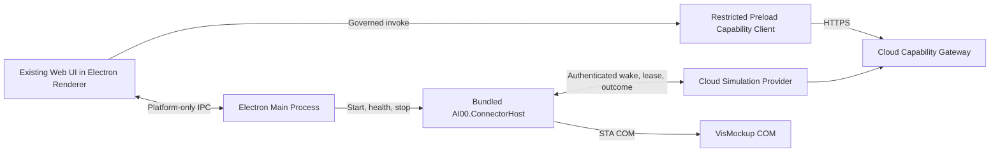

# Governed Electron App Migration Design

## Status and decision

This specification defines the Windows desktop successor to the current web plus AI Connector deployment. The approved direction is an Electron application that reuses the current production web assets without a UI rewrite, connects to the existing cloud backend, and ships the VisMockup Connector as an application-owned component.

The first supported platform is Windows x64. The product has one installer, one application entry, one update channel, and one AI00 tray presence. The Connector is not installed as a Windows Service, does not expose its own tray icon, and cannot run independently as a user-facing product. Electron and Chromium use multiple operating-system processes by design; this specification does not require a single process in Task Manager. It requires one product lifecycle controlled by the Electron main process.

The implementation baseline is the `test` branch at frontend commit `08222e876d0ab8a8c477e6d66b6bda66ac70af88` and backend commit `561efece898d8cf5a78d6e3855c5669c8bbf619b`.

## Goals

- Preserve the current UI structure, styling, iframe behavior, navigation, custom title bar, shortcuts, themes, and workflows by packaging the existing Vite production output in Electron.
- Keep the cloud backend and Capability Gateway as the sole authority for business authorization, confirmation, state transitions, execution plans, audit, and result projection.
- Replace the independently installed Connector Service, Connector tray, SessionHost, and legacy Python VisMockup Bridge with one hidden ConnectorHost distributed and controlled by the Electron application.
- Preserve the existing C# VisMockup adapter, COM/STA execution, device credential, signed-plan, lease, idempotency, timeout, recovery, and outcome code where its contracts already meet this specification.
- Produce one signed Windows x64 installer with coordinated App and ConnectorHost versions, upgrade, rollback, repair, and uninstall behavior.
- Require complete Capability governance and release evidence before an App release candidate can be promoted.

## Non-goals

- Rewriting the current web UI in WPF, WinUI, React, or another UI framework.
- Packaging the cloud backend or database inside the desktop application.
- Supporting macOS, Linux, ARM64, offline business operation, or a local business data store in the first release.
- Allowing Renderer code, Electron IPC, a named pipe, or ConnectorHost to become an alternative business command channel.
- Restoring browser-to-loopback HTTP, the Python VisMockup Bridge, or direct browser-to-COM access.
- Adding a general-purpose local plugin execution system as part of this migration.

## System architecture

The system retains the current cloud control plane and changes the desktop delivery boundary.

The Renderer expresses business intent only through the Capability Gateway. The Electron main process supplies platform functions such as window management, file selection, notifications, update control, and ConnectorHost lifecycle. ConnectorHost obtains executable work only from the cloud control plane. A local message from Renderer or Electron main can never authorize or describe a VisMockup business operation.

## Component responsibilities

### Existing Web UI

The App packages the existing `dist-production` UI. App migration work must not restructure page layout or replace current components during the initial migration. Existing relative and absolute resource paths are served from a secure application origin. Critical pages receive screenshot and interaction regression coverage so Chromium or packaging changes are detected.

The Renderer cannot access Node.js, Electron primitives, device credentials, local plan signatures, unrestricted filesystem APIs, or raw IPC. It receives a small frozen bridge from preload.

### Restricted preload bridge

The existing broad `electronAPI` surface is inventoried and divided into two classes:

- Platform operations: bounded window, dialog, notification, deep-link, update, and user-selected file operations. These remain IPC operations with closed request and response schemas.
- Governed invocation transport: one closed `capability:invoke` IPC method carries an exact Capability ID and InvocationEnvelope to Electron main. Main can send it only to the configured cloud Gateway and cannot dispatch it to local business code.
- Legacy business operations: any IPC method or arbitrary HTTP wrapper that reads or changes AI00 business state outside `capability:invoke`. These are removed.

The preload Capability client validates the public request shape and invokes `capability:invoke`; Electron main calls the existing canonical route `/api/v1/capabilities/{capability_id}:invoke`. Its closed `InvocationEnvelope` carries `major_version`, Catalog Release, operation and idempotency identity, confirmation token, and resource selectors. No second Gateway URL is introduced by this migration. Authentication material remains outside preload and page JavaScript. Page code receives normalized success or structured failure envelopes and cannot obtain the raw login or device credential.

The Renderer receives only `{mode, user, expires_at}` authentication state. It cannot retrieve the access or refresh token. Electron main starts OAuth Authorization Code with PKCE in the system browser, stores `state` and the verifier in process memory, validates the `ai00://auth/callback` state, exchanges the short-lived code directly with the cloud, and rejects tokens or credentials embedded in the callback URL. Access and refresh tokens exist only in Electron main; main attaches the access token when it forwards `capability:invoke` to the fixed Gateway origin. The main process owns token refresh, logout, and multi-window authentication broadcasts. Preload replaces arbitrary-path `_cloudFetch(path, opts)` with `invokeCapability(capabilityId, envelope)` and the small set of separately reviewed non-business authentication operations. The cloud session contains a server-signed desktop consumer claim; the Gateway derives consumer identity from that claim and rejects a Renderer-supplied identity override.

### Electron main process

The main process owns application lifecycle, windows, the single AI00 tray, deep links, global shortcuts, platform dialogs, updater orchestration, logging, and ConnectorHost supervision. It validates every IPC request against an allowlist and a closed schema. It restricts file access to paths selected by the user or application-owned directories and validates every external URL before opening it.

At startup it launches the packaged ConnectorHost with an unguessable per-launch named-pipe name, a per-launch nonce, and the Electron parent process identifier. It assigns ConnectorHost to a Windows Job Object configured with `KILL_ON_JOB_CLOSE`. The handshake validates both process IDs, the installed executable path, Authenticode signer, installer-manifest digest, and the launch nonce before accepting status messages. It does not send business payloads, user access tokens, bootstrap secrets, or device credentials over that pipe. It receives only version, readiness, health, non-secret pairing ID, pairing state, and bounded diagnostic events. On normal exit it requests graceful shutdown and then closes the Job Object. ConnectorHost also exits when the verified parent disappears.

The App has one instance per Windows user. A second launch in the same user session activates the existing window. A different Windows user receives a different DPAPI identity and cannot share the first user's ConnectorHost. Fast user switching therefore creates separate inactive or active device identities rather than two runtimes leasing under one credential.

Only AI00-owned child processes join the Job Object. If an approved Capability launches VisMockup, ConnectorHost uses the allowlisted signed installation path and `CREATE_BREAKAWAY_FROM_JOB` under a Job configured for explicit breakaway. It verifies that the VisMockup process is outside the AI00 Job before reporting launch success. Closing AI00 never terminates a VisMockup process, whether it was already running or launched through AI00.

### AI00.ConnectorHost

`AI00.ConnectorHost.exe` is a Windows x64 .NET application shipped inside the Electron installer. It runs hidden in the interactive user session so it can use VisMockup COM. It reuses the existing Connector contracts and adapters, but replaces the Service, Tray, and SessionHost topology with one application-owned host.

ConnectorHost owns:

- DPAPI-protected device credentials bound to the current Windows user.
- Device pairing and activation state supplied by the cloud control plane.
- Authenticated outbound WebSocket wake-up and bounded HTTP polling fallback.
- Signed execution-plan v2 leasing, validation, generation fencing, replay protection, and expiry checks.
- Adapter compatibility and contract-hash validation.
- STA scheduling, VisMockup process detection, COM execution, step timeout, cancellation, and structured outcomes.
- Durable recovery metadata needed to reconcile an interrupted lease after App restart.

ConnectorHost does not listen on TCP, expose a loopback API, display a tray icon, accept Renderer commands, or make business authorization decisions.

### Cloud control plane

The existing cloud backend remains the deployment and business authority. It continues to provide Capability discovery and invocation, authentication, device pairing, plan creation, explicit confirmation, signed plan queueing, leases, wake-up, outcome ingestion, audit, and business-state projection.

Cloud additions comprise App compatibility policy, execution-plan/outcome v2, possession-based pairing, runtime-generation fencing, and evidence required by this design. The policy binds minimum supported App version, Connector protocol version, adapter version, and Catalog Release. An incompatible App may use non-device features when safe, but local execution fails closed with a structured upgrade requirement.

## Capability governance

The desktop migration is governed as a change of consumers and providers, not as permission to reuse the old App's direct IPC or REST behavior.

### Consumer and provider identities

- The packaged Renderer is registered as a desktop web consumer with exact frontend source and build evidence. Its identity comes from a server-signed desktop session claim, not request JSON.
- ConnectorHost is registered as a local-runtime consumer and execution provider with exact executable, protocol, adapter, and source evidence.
- Electron main is a platform host. It is not registered as a business provider unless a future requirement introduces a real business Capability owned by a domain.
- Each App release binds its frontend commit, backend Catalog Release, ConnectorHost build, adapter manifest, and installer digest.

### Invocation rules

- Every business read and write starts at the existing `/api/v1/capabilities/{capability_id}:invoke` route or its governed streaming equivalent. `major_version`, Catalog Release, consumer, operation, confirmation, and idempotency fields are carried in the closed `InvocationEnvelope`.
- New direct REST routes, Electron IPC business methods, loopback methods, and Renderer-to-Connector commands are release blockers.
- A local side effect requires the new closed `ai00.connector.execution-plan.v2` contract, bound to capability ID, major version, capability-version GID, business-definition hash, Catalog Release, tenant, actor, device, runtime generation, runtime instance ID, adapter contract, normalized input hash, confirmation receipt when required, idempotency identity, issue time, expiry time, and ordered steps. The matching closed Outcome v2 binds plan hash, lease, generation, runtime instance, step journal identity, result hashes, and reconciliation state.
- Plan and Outcome v2 are new protocol versions. Their security fields are not added as optional v1 fields. The cloud can distinguish v1 and v2 during migration, while the Electron ConnectorHost accepts only v2. Unknown, removed, downgraded, or altered fields invalidate the canonical signature.
- ConnectorHost verifies the plan signature and every binding before execution. Unknown fields, versions, operations, steps, or algorithms fail closed.
- Plans use cloud-held ECDSA P-256 private keys and include `signature_algorithm=ecdsa-p256-sha256` plus `key_id`. ConnectorHost contains only trusted public keys and therefore cannot mint a cloud-authorized plan. Trusted keys come from the signed App manifest and an authenticated, signature-chained rotation document. A revoked key or a plan issued outside its key validity interval fails closed.
- Outcomes use a persistent device-signing ECDSA P-256 private key generated during pairing and protected with current-user DPAPI. This key is distinct from the disposable bootstrap-encryption key. The cloud stores the device-signing public key and verifies each Outcome v2 signature. Results are bound to the leased plan and step. Only the cloud Provider can apply the resulting business transition.
- WebSocket messages are wake-up signals only. They cannot contain an executable plan or command.

### Protocol v2 required records

Execution-plan v2 is a closed record with these required fields: `protocol`, `plan_id`, `capability_id`, `major_version`, `capability_version_gid`, `business_definition_hash`, `catalog_release`, `tenant_id`, `actor_id`, `device_id`, `runtime_generation`, `runtime_instance_id`, `adapter_id`, `adapter_major`, `target_product`, `normalized_input_hash`, `confirmation_receipt_id`, `idempotency_key`, `steps`, `issued_at`, `expires_at`, `plan_hash`, `signature_algorithm`, `key_id`, and `signature`. `confirmation_receipt_id` is an explicit JSON null only for a Capability whose descriptor does not require confirmation. Each step remains closed and binds `step_id`, `operation_id`, `contract_hash`, dependencies, payload, payload hash, timeout, side-effect classification, and post-condition probe ID.

Outcome v2 is a closed record with `protocol`, `plan_id`, `plan_hash`, `lease_id`, `tenant_id`, `device_id`, `runtime_generation`, `runtime_instance_id`, `overall_status`, ordered step results, `journal_sequence`, `reported_at`, `signature_algorithm`, `device_key_id`, and `signature`. Each step result binds start and completion time, status, result and result hash, error code, and reconciliation state. Allowed terminal execution states are `succeeded`, `failed_without_effect`, `outcome_unknown`, and `manual_review_required`; transport failure is not an execution result.

Protocol v2 has one cross-language wire representation. JSON is encoded as UTF-8 RFC 8785 JSON Canonicalization Scheme bytes. Integers, timestamps, nulls, arrays, and property names must already satisfy the closed schema before canonicalization; non-finite numbers and schema coercion are rejected. `plan_hash` is lower-case hexadecimal SHA-256 over the canonical plan projection that excludes both `plan_hash` and `signature`. The plan signature is ECDSA P-256 with SHA-256 over the canonical plan projection that includes `plan_hash` and excludes only `signature`. The Outcome signature uses the same algorithm over the canonical Outcome projection that excludes only `signature`. ECDSA signatures use fixed 64-byte IEEE-P1363 `r || s`, require low-S form, and are encoded as unpadded Base64URL. P-256 public keys use JWK `kty=EC`, `crv=P-256`, and unpadded Base64URL `x` and `y`; private JWK material is never serialized into a protocol or manifest. The repository contains immutable Python/.NET bidirectional golden vectors for canonical bytes, hashes, public keys, accepted signatures, and rejection of DER, padded Base64, high-S, mutated, or unknown-field records.

The cloud stores the current `runtime_generation` on the device row. A lease row records `(device_id, runtime_generation, runtime_instance_id, protocol, plan_id, lease_id, expires_at)`. Pairing records store `pairing_id`, public key, nonce hash, requested expiry, bound tenant/user after approval, state, and single-use activation timestamp. Migrations are additive during the pilot; v1 rows remain distinguishable and cannot be interpreted as v2.

### Release evidence

An App release candidate cannot be promoted until its computed impact closure has current machine evidence and runtime verification. The closure contains every changed Capability descriptor, Provider, consumer, policy, execution-plan/outcome protocol, adapter contract, database migration, Gateway route, IPC boundary, packaged executable, and transitive Capability dependency. Capability business-definition and business-behavior changes must separately satisfy the governance meaning of `human_approved=true`; that field is not reused as approval for binaries, migrations, IPC, or installer content. Those technical artifacts require their own signed release-approval record naming immutable hashes, reviewers, approval time, and expiry. A reviewer must hold the dedicated `desktop_release_approver` governance role and cannot approve a release they authored. At promotion and update time, the server verifies the record against the configured release-authority public keys, current role assignment, expiry, threshold, and revocation state; revoked approval keys or roles invalidate unpromoted records. Promotion requires `machine_passed=true`, applicable Capability `human_approved=true`, `runtime_verified=true`, and a valid technical release approval. Evidence binds immutable Git revisions and generated artifacts rather than a dirty working tree.

The current historical blockers must be resolved before the first App release candidate:

- The business-definition hashes for `ontology.concept.get@1`, `ontology.concept.resolve@1`, and `ontology.object.list@1` differ from the legacy governance baseline after the governed schema restoration commit.
- The checked-in Agent runtime closure acceptance evidence does not contain the required `business_governance` section.

Stage 0 records an immutable baseline Snapshot containing the two Git commits named above, Catalog Release `rel_6b7ac7cd21ed113da5a033e433f09a37`, the exact Finding set for these blockers, and the resulting Release Gate report ID. Resolving the blockers requires corrected versioning or approved business-definition evidence and regenerated closure evidence. The App migration must not weaken the Release Gate or silently rewrite the legacy baseline.

## Runtime flows

### Startup and compatibility

1. Electron acquires the single-product lock and creates the login or main window.
2. The main process launches ConnectorHost and establishes the per-launch named pipe.
3. The App loads its packaged UI from a secure local application origin.
4. After authentication, the Capability client obtains the cloud Catalog Release and compatibility policy.
5. The client rejects capabilities absent from or incompatible with the pinned release.
6. ConnectorHost authenticates with its device credential, current runtime generation and runtime instance ID, reports execution-plan v2 and adapter versions, and starts the wake-up channel.
7. The UI displays Connector readiness from cloud-owned pairing and health state. Local diagnostic state may enrich the display but cannot override cloud authorization.

### Governed VisMockup execution

1. Renderer invokes the relevant Simulation Capability through the cloud Gateway.
2. Gateway authenticates the user and desktop consumer, authorizes tenant and resource scope, validates the closed input schema, and records audit identity.
3. The Simulation Provider prepares an immutable plan and, where required, returns the exact downstream confirmation challenge.
4. Renderer resubmits the approved challenge with the same operation and idempotency identity.
5. Provider queues the signed device-bound plan and emits a wake-up signal.
6. ConnectorHost leases the plan over authenticated HTTPS. The lease is fenced to the current device credential generation, runtime instance ID, and execution-plan v2 protocol. ConnectorHost verifies every signed binding.
7. ConnectorHost writes the plan, lease, generation, step and pre-execution state to its durable journal before the adapter begins the bounded STA operation.
8. The adapter executes the bounded operation through the STA dispatcher.
9. ConnectorHost submits the authenticated Outcome v2. The Provider applies, rejects, or holds the state transition for reconciliation and records audit evidence.
10. Renderer obtains the authoritative result from the cloud Capability state, never from an unaudited local success message.

### Pairing

Pairing uses proof of possession and never transfers a bootstrap secret through Renderer, command-line arguments, URLs, logs, or the local named pipe:

1. ConnectorHost generates a persistent ECDSA P-256 device-signing key pair, protects its private key with current-user DPAPI, and separately generates a one-time RSA-OAEP-SHA256 bootstrap-encryption key pair and nonce.
2. ConnectorHost registers both public keys and the nonce with the cloud bootstrap endpoint and receives a short-lived non-secret `pairing_id`.
3. ConnectorHost reports only `pairing_id` over the authenticated diagnostic pipe.
4. Renderer invokes the authenticated pairing Capability with `pairing_id`; the cloud binds the pending record to the logged-in user and tenant.
5. ConnectorHost polls activation while proving possession of the device-signing key and bootstrap-encryption key through separate signed and encrypted challenges.
6. The cloud binds the device-signing public key to the device record, encrypts the new runtime credential to the bootstrap-encryption public key, and atomically creates a new credential generation.
7. ConnectorHost decrypts and stores the runtime credential under current-user DPAPI, retains the DPAPI-protected device-signing private key for authenticated requests and Outcome v2 signatures, then irreversibly discards only the RSA bootstrap private key and nonce.

The state machine is `created → user_bound → activated` with terminal `expired` and `cancelled` states. A `pairing_id` is single-use, expires after the configured bounded lifetime, and cannot be rebound to another user or tenant. Activation, cancellation, expiry, wrong-user, wrong-tenant, nonce replay, and possession failure are audited and tested.

### Runtime generation and cutover fencing

Each device record has a monotonically increasing `runtime_generation`. Activating the Electron ConnectorHost, switching back to the legacy Connector, repairing credentials, or rolling back creates a new generation transactionally. Each runtime launch also has a unique `runtime_instance_id`.

Before opening wake-up or leasing, ConnectorHost registers a runtime session using its current device credential and generation. Registration succeeds only when no unexpired runtime session exists and the device has no `leased`, `executing`, `outcome_unknown`, or `manual_review_required` plan. After a clean shutdown, or after a short session TTL expires with no such plan, the cloud compare-and-set transaction installs `current_runtime_instance_id` and issues a short-lived runtime-session token bound to that instance. A stale process cannot replace an unexpired current instance, and a process that loses a registration race cannot retry to evict the winner.

Replacing a live or uncertain runtime requires a user-authenticated takeover Capability. It first requires all leased, executing, unknown, and manual-review work to reach an explicitly reconciled terminal state; otherwise it fails closed. The takeover transaction increments `runtime_generation`, clears the old current session, installs the new runtime identity, and audits the actor and reason. Registration, heartbeat, lease, renewal, Outcome, and reconciliation use compare-and-set semantics on device generation and current instance.

Wake-up authentication, heartbeat, plan lease, lease renewal, Outcome v2, and reconciliation calls must match the current generation, current registered instance, runtime-session token, and permitted runtime type. The cloud rejects all calls from an older generation or replaced instance even if its credential remains locally available. A rollback creates another generation; it never reactivates an old generation. This fencing, rather than a local process lock, prevents the old Windows Service, stale App process, and current App from executing the same device work during pilot migration.

### Update

The signed release manifest describes the Electron version, ConnectorHost version, protocol versions, adapter manifest hash, installer digest, channel, minimum security version, local-state schema versions, and rollback compatibility. Windows Authenticode proves publisher identity and binary integrity at installation and launch. The separately signed release manifest binds the approved component set and rollout policy. Their trust roots, key IDs, rotation overlap, revocation list, and emergency minimum version are part of the release configuration.

Electron owns update discovery and user interaction. It verifies HTTPS origin, manifest signature, installer digest, Authenticode chain, anti-downgrade policy, and minimum security version before installation. Installation is atomic at the product level: App and ConnectorHost cannot be updated independently. ConnectorHost is stopped before replacement. On every launch, Electron verifies the ConnectorHost path is under the immutable installation directory and its digest matches the installed manifest before execution. ConnectorHost uses an application-owned working directory and absolute DLL resolution so the current directory and user-writable search paths cannot inject code.

DPAPI credentials, execution journal, and updater state each carry an explicit schema version. Forward migrations are atomic and retain a rollback-readable copy only when the signed manifest declares backward compatibility. Otherwise rollback creates a new runtime generation and requires re-pairing rather than interpreting newer security state with older code. Failed installation retains the previous complete version.

## Cloud deployment impact

The backend, Capability Gateway, domain Providers, database, and Connector control plane remain cloud deployed. No local backend or local database is introduced. The existing authenticated WebSocket endpoint remains a wake-up transport, with bounded HTTP polling as loss recovery.

The cloud deployment gains execution-plan/outcome v2, possession pairing, runtime-generation fencing, reconciliation state, App compatibility policy, and signed release metadata, but does not require a new independently scaled business service. These remain in the existing Simulation control plane and Capability governance deployment. Schema migrations are additive and limited to fields or records missing from the current device, plan, lease, outcome, audit, and compatibility models.

During migration, the current web deployment remains available for rollback and users not yet moved to the App. After App adoption and runtime evidence meet the agreed threshold, ordinary user navigation to the web product can be retired separately. Administrative diagnostics may remain web hosted if they are explicitly governed and operationally required.

App binaries are published through a release-artifact channel rather than committed to Git history. Gitea retains full source history; GitHub receives sanitized source snapshots when repository history contains oversized installers. GitLab is outside the publishing scope.

## Failure and recovery behavior

- ConnectorHost unavailable: App remains usable for cloud-only capabilities; device-dependent capabilities return an explicit unavailable state and a bounded repair action.
- Wake-up connection unavailable: ConnectorHost reconnects with bounded backoff and uses the existing two-second poll as recovery. The plan lease remains authoritative.
- App or ConnectorHost crash: the Job Object stops ConnectorHost when its parent disappears. Any step whose COM invocation began without a committed terminal result becomes `outcome_unknown` and enters reconciliation after restart; it is not automatically replayed when the lease expires.
- VisMockup absent or incompatible: the adapter returns a structured non-retriable compatibility error without launching an alternative executable or performing a partial command.
- COM timeout, cancellation after invocation begins, or process loss: the current step records `outcome_unknown` because COM may have completed without returning. Later steps stop. The cloud blocks an equivalent side-effect plan until reconciliation reaches a terminal result.
- Reconciliation: every side-effecting adapter operation declares a bounded post-condition probe. The probe classifies the prior step as `succeeded`, `failed_without_effect`, or `manual_review_required`. Only `failed_without_effect` permits a new equivalent plan. Operations without a reliable probe always require manual review after an unknown outcome.
- Signature, hash, device, tenant, actor, Catalog, version, expiry, or replay failure: execution is rejected before COM invocation and a security audit event is submitted when authentication permits.
- Cloud unavailable: no new local business operation begins. Pending UI intent remains uncommitted and is safe to retry with its original idempotency identity.
- Update failure: the prior complete signed version remains runnable. An App/ConnectorHost version mismatch prevents local execution.
- Local diagnostic pipe failure: business execution can continue through the cloud control plane; the UI shows diagnostic state as unavailable rather than inferring success.

## Security boundaries

- BrowserWindow instances use context isolation, disabled Node integration, sandboxing where supported, a restrictive Content Security Policy, navigation allowlists, permission denial by default, and validated external-link handling.
- The local application origin resolves only packaged allowlisted files and rejects traversal, encoded traversal, unexpected hosts, and mutable remote content.
- Preload exposes named functions rather than `ipcRenderer`, `shell`, arbitrary channels, arbitrary filesystem paths, or arbitrary URLs.
- The main process applies schema validation and sender-origin validation to every IPC handler.
- Device credentials are DPAPI protected, never returned to Renderer, and redacted from logs and crash reports.
- Named-pipe access is restricted to the current user and launch instance. Its closed protocol uses mutual process checks, installed-path and signer verification, manifest-digest verification, and a per-launch nonce handshake in addition to the Windows ACL.
- Connector plan/outcome v2 uses the existing canonical JSON rules and ECDSA P-256 signatures with the new required v2 fields. ConnectorHost never receives the cloud signing private key. Compatibility changes require a new protocol or Capability version instead of permissive parsing.
- Third-party Electron plugin windows are disabled in the first App release. Only signed official assets packaged in the immutable App manifest may open an App window. A future third-party window design requires its own signed package policy, isolated session partition, sandbox, zero `electronAPI` exposure, and Capability consumer allowlist.

## Packaging and lifecycle

The supported artifact is one Windows x64 installer produced by Electron Builder. It contains the production web assets, Electron main and preload files, official desktop plugin assets, ConnectorHost, the required .NET runtime or self-contained output, and signed release metadata. It excludes backend source, test fixtures, local secrets, generated test directories, update installers from prior versions, and developer tools.

Installation creates the AI00 App registration, deep-link protocol, shortcuts, and updater metadata. It does not create a Windows Service or a separate Connector startup entry. Uninstall removes application-owned binaries and registrations. User-owned documents remain unless the user explicitly chooses removal. Device credentials, execution journal, pairing state, and updater security state are deleted on full uninstall; an in-place update preserves and migrates them only under the signed compatibility rules above.

## Planned source boundaries

The implementation plan uses these project boundaries so the migration does not grow another parallel architecture:

- `packages/core/electron/main.js`: composition root only; delegates security, authentication, protocol, update, and ConnectorHost lifecycle.
- `packages/core/electron/capability_client.js`: main-process-only canonical Gateway client, closed InvocationEnvelope, token custody, desktop session claim, confirmation, and retry identity; it is never imported by preload or Renderer code.
- `packages/core/electron/connector_host_manager.js`: signed-binary verification, Job Object lifecycle, launch nonce, diagnostic-pipe handshake, readiness, and shutdown.
- `packages/core/electron/preload.js`: frozen Renderer API containing governed capability invocation and bounded platform functions.
- `packages/core/electron/auth_manager.js`: OAuth callback validation, token refresh, redacted state, logout, and multi-window synchronization.
- `packages/core/electron/plugin_manager.js`: official packaged-window enforcement; third-party Electron windows fail closed.
- `local-runtime/src/Ai00.Connector.AppHost/`: the new application-owned executable and composition root.
- `local-runtime/src/Ai00.Connector.Contracts.V2/`: closed plan, Outcome, pairing proof, generation, journal, and diagnostic contracts. Existing v1 types remain unchanged for the legacy runtime during migration.
- `local-runtime/src/Ai00.Connector.Adapters.VisMockup/`: existing COM adapter plus explicit post-condition probes for side-effecting operations.
- `plugins/simulation/simulation_backend/application/`: plan/outcome v2 issuance, possession pairing, generation fencing, reconciliation, and compatibility policy.
- `backend/db/migrations/domains/simulation/`: additive device-generation, runtime-instance, pairing-proof, v2 plan/outcome, and reconciliation persistence.
- `backend/capability_v2/` and generated governance documents: desktop consumer, provider, impact-closure, release evidence, and route enforcement.

No business implementation is added to the Electron main process or named-pipe layer. Code currently located in Service, Tray, and SessionHost projects is moved or referenced by AppHost according to responsibility, then those deployment entry points are removed only after parity and cutover tests pass.

## Migration stages

### Stage 0: close baseline governance blockers

Resolve the three Ontology business-definition baseline mismatches and regenerate the Agent closure evidence. Establish a passing Release Gate on immutable frontend and backend commits before App-specific changes are accepted.

### Stage 1: govern the existing Electron shell

Keep the UI unchanged. Inventory main/preload IPC and all Electron-only call sites, classify platform and business operations, remove direct business paths, restrict the application protocol and BrowserWindow settings, register desktop consumer identity, and add packaged UI regression coverage.

### Stage 2: add cloud protocol v2 and migration fencing

Add closed execution-plan and Outcome v2 contracts, possession-based pairing, runtime generation and instance fencing, reconciliation state, compatibility policy, additive migrations, and downgrade tests. Keep v1 available only for the identified legacy runtime during the pilot. The cloud must pass generation-race and unknown-outcome tests before AppHost can lease a production plan.

### Stage 3: create the application-owned ConnectorHost

Build one .NET host from the existing Connector contracts, service worker, SessionHost, and VisMockup adapter code. Run it in the interactive user session, accept only protocol v2, add the durable pre-execution journal, post-condition probes, parent-lifecycle supervision and authenticated diagnostic messages, and retain cloud-only business command flow. Prove parity with existing Connector tests before removing old deployment projects.

### Stage 4: integrate product lifecycle

Package ConnectorHost with Electron, implement coordinated startup, repair, update, rollback, and uninstall, and remove the Python Bridge, independent Service installer, separate Tray, and SessionHost launch paths from the App distribution.

### Stage 5: pilot and cutover

Release to a bounded Windows x64 pilot group. Collect runtime evidence for pairing, wake-up latency, plan execution, VisMockup lifecycle, crash recovery, upgrade, rollback, and uninstall. Promote only after governance approval and runtime verification. Retain web and old Connector rollback paths during the pilot, then retire independent Connector distribution after the cutover criteria pass.

## Verification strategy

### Static and contract checks

- Capability Catalog generation and Release Gate validation.
- Desktop consumer and local-runtime provider coverage with immutable source hashes.
- Canonical `/api/v1/capabilities/{id}:invoke` route enforcement and closed InvocationEnvelope validation.
- Direct REST, arbitrary `_cloudFetch`, loopback, IPC business-route, and Renderer-to-Connector scans.
- Closed JSON schemas for preload IPC, named-pipe diagnostics, execution plans, outcomes, and update manifests.
- Installer-content allowlist and oversized or secret artifact scans.

### Automated tests

- Existing frontend test suite against both source and packaged production assets.
- Screenshot and interaction regression tests for login, workspace, Craft lineage, standard operations, Simulation/VisMockup, settings, pop-out windows, and approval flows.
- Electron main/preload tests for PKCE state and callback validation, server-signed consumer claims, token isolation, refresh/logout synchronization, sender validation, navigation, protocol traversal, file bounds, official-only plugin windows, and process supervision.
- ConnectorHost unit tests for Job Object parent exit, per-user/device single-instance behavior, fast user switching, named-pipe ACL and mutual handshake, binary digest validation, startup failure, shutdown, recovery, and version mismatch.
- Existing Connector contract, DPAPI, plan, lease, signature, replay, STA, timeout, cancellation, and VisMockup adapter tests.
- Protocol v2 tests for missing and unknown fields, deletion and mutation of every signed binding, v1 downgrade attempts, Catalog mismatch, wrong confirmation, wrong normalized input, expired plans, Outcome-to-plan mismatch, cloud ECDSA signing, public-key-only Connector validation, persistent DPAPI-protected device-key Outcome signing, key rotation, revocation, and the checked-in Python/.NET RFC 8785 and IEEE-P1363 golden vectors.
- Pairing tests for proof of possession, expiry, single use, cancellation, nonce replay, wrong user, wrong tenant, credential encryption, and DPAPI persistence.
- Generation-fencing and runtime-session tests that race legacy, stale App, and current App runtimes; reject registration while a session is live or work is leased, executing, unknown, or awaiting manual review; prevent a losing same-generation process from evicting the winner; require authenticated takeover to increment generation; and reject stale-generation or replaced-instance wake-up, heartbeat, lease, renewal, outcome, reconciliation, and rollback calls.
- Unknown-outcome tests that persist the journal before COM, stop later steps, block equivalent plan issuance, run each declared post-condition probe, and require manual review when reconciliation cannot prove absence or presence of the side effect.
- Cloud tests for App compatibility policy, device binding, confirmation, wake-up transport, lease recovery, outcome application, reconciliation, and audit.
- Installer tests on clean Windows x64 and upgrade tests from the last supported App version, including proof that closing the AI00 Job stops ConnectorHost without stopping an existing or AI00-launched breakaway VisMockup process.

### Runtime evidence

Runtime verification records exact App, ConnectorHost, backend, Catalog, adapter, and installer identities. The pilot exercises normal execution and failure injection for lost WebSocket, cloud outage, App crash, ConnectorHost crash, VisMockup absence, COM timeout, duplicate delivery, expired plans, incompatible versions, failed update, rollback, and uninstall. Evidence includes plan creation-to-step-start latency and proves that no local command bypass occurred.

## Acceptance criteria

- Current UI pages and key interactions remain within the approved visual and behavioral regression baseline.
- Users install, start, update, repair, and uninstall one AI00 Windows x64 product.
- No AI00 Connector Windows Service, separate Connector tray, SessionHost product entry, Python Bridge, or loopback business endpoint remains in the App distribution.
- All business reads and writes originate through governed Capability invocation.
- Every VisMockup side effect is traceable to one valid cloud-issued plan and one authoritative cloud outcome.
- Renderer and Electron IPC cannot submit a local business command or access device credentials.
- App and ConnectorHost version compatibility fails closed and is observable.
- Cloud-only functionality remains available when ConnectorHost is unavailable.
- App crash, ConnectorHost crash, network loss, duplicate delivery, update failure, and rollback do not duplicate a business side effect.
- The complete release evidence reports `machine_passed=true`, applicable Capability `human_approved=true`, `runtime_verified=true`, and a valid signed technical release approval for the release candidate.

## Main risks and controls

- Broad legacy Electron IPC: inventory every exposed method, default deny, and remove business operations before enabling App release.
- UI drift during packaging: reuse the existing build output and gate critical pages with screenshots and interaction tests.
- Hidden command bypass through local diagnostics: keep the named pipe status-only and test that executable payload fields are rejected.
- Connector lifecycle races: combine Windows Job Object ownership, signed-path and digest verification, launch-nonce handshake, runtime-generation fencing, and per-user/device single-instance behavior; test start, quit, crash, fast user switching, update, rollback, and recovery sequences.
- Version skew: publish App and ConnectorHost atomically and enforce cloud compatibility before leasing plans.
- Irreversible COM uncertainty: journal before invocation, return `outcome_unknown`, stop the plan, reconcile by declared post-condition probe, and forbid automatic replay.
- OAuth or consumer spoofing: use Authorization Code with PKCE, keep tokens in main, derive the desktop consumer from a server-signed session claim, and reject request overrides.
- Untrusted plugin windows: disable third-party Electron windows in the first release and package only signed official assets.
- Migration rollback complexity: preserve the web and old Connector rollout paths until pilot evidence passes, while preventing simultaneous leasing by old and new runtimes for the same device.
- Governance debt: close existing Release Gate blockers in Stage 0 rather than weakening validation or treating the App migration as an exemption.
